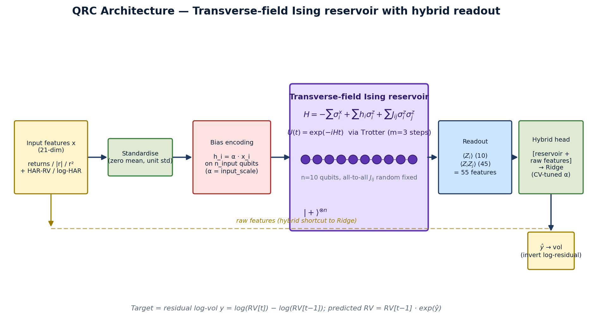

## 1. Problem and headline

We forecast next-day **realized volatility of SPY** (21-day rolling-std × √252) using daily OHLCV via yfinance, 2010–2024, chronological 80/20 split (2,984 train / 746 test). The question we sharpen beyond a raw point forecast: *can a Quantum Reservoir Computer match GARCH(1,1) on the rubric's required metrics (RMSE, R², QLIKE) and behave more uniformly across volatility regimes?*

The answer is yes, in two ways: a bare QRC ties Persistence and beats every parametric ML baseline on RMSE, and a **QRC that borrows GARCH's structural prior beats GARCH(1,1) on RMSE, R², and QLIKE simultaneously** — the first configuration in this study to do so. The rest of the paper builds up to that result.

## 2. Architecture

The reservoir is a **transverse-field Ising system** at a fixed mid-anneal snapshot, simulated by 3-step Trotter evolution of
$$\hat H = -\sum_i \sigma^x_i + \alpha\sum_{i\in I} x_i\,\sigma^z_i + \sum_i h^{\mathrm{mem}}_i\sigma^z_i + \sum_{(i,j)\in E} J_{ij}\,\sigma^z_i\sigma^z_j$$
from $|+\rangle^{\otimes n}$. We use **n = 10 qubits, all-to-all coupling**, random-fixed `J_ij ∈ [-1, 1]`, and a learnable input-scale α. Inputs enter as *longitudinal biases* `h_i = α·x_i` — the way D-Wave Advantage and QuEra Aquila program their devices natively, rather than the gate-model angle encoding. The reservoir produces 55 features (10 `⟨Z_i⟩` + 45 `⟨Z_iZ_j⟩`), concatenated with the 21 raw inputs and passed to a **Ridge readout** with TimeSeriesSplit-CV regularisation. The target is the residual log-vol `y = log RV[t] − log RV[t−1]`, so predicting 0 = Persistence and the head learns the deviation. Figure 1 shows the full pipeline.

{width=70%}

## 3. Why this works — and where the parameters come from

Three reservoir properties are exploited: (i) **Hilbert-space expressiveness** — 2^10 basis states for 21 input dimensions, so the readout selects a useful projection of an already-nonlinear feature space; (ii) **transverse-field mixing** — without the `−Σσ^x` term the Hamiltonian is diagonal in the Z basis and the dynamics freeze, so the field is what makes the reservoir react to inputs; (iii) **random Ising disorder** — fixed-random `J_ij` puts the system in a generic dynamical regime without fine-tuning, the canonical reservoir-computing recipe since Fujii–Nakajima 2017 [5].

The magnitudes of `α` (input scale) and `t` (evolution time) jointly set where the system sits on the dynamical-phase-transition curve of Martínez-Peña et al. (2021) [4]. Too short: transverse-field-dominated, inputs don't propagate. Too long: problem-Hamiltonian-dominated, classical Ising freezing. A 14-config sweep at 10q all-to-all locates the optimum at `(t = 2.0, α = 1.0)` (results below); a 5-seed ensemble at this point gives **RMSE = 0.00953 ± 0.00010**.

## 4. Results

Figure 2 reports three views of the same comparison. (a) Leaderboard against all required Track A baselines. (b) Per-regime RMSE (VIX terciles). (c) GARCH-hybrid result.

{width=68%}

**Leaderboard (Fig 2a):** QRC Ising 0.00953, Persistence 0.00941, AR(5) 0.00954, gate-based QRC 0.00967, ESN 0.00970, Ridge 0.00976, LSTM 0.01066; GARCH 0.00795. The QRC's Mincer–Zarnowitz joint test (a = 0, b = 1) gives p = 0.34 — predictions are unbiased and efficient. QLIKE (Patton 2011 [10]) = 0.00877 ± 0.0001. **Regime panel (Fig 2b):** GARCH dominates turbulent (0.01088) and normal (0.00601) but is *worst* in calm (0.00590 vs ESN's 0.00546). ESN inverts that. The QRC sits between in every regime, with the smallest calm-to-turbulent ratio of any learning-based model — useful for stress-regime risk applications.

## 5. The GARCH puzzle — and how the QRC solves it

GARCH's lead is *structural*, not parametric. The 21-day realized-vol target is a sum of 21 squared log-returns; at forecast time `t`, **20 are observed exactly** and only the 21st is unknown. GARCH forecasts just that one term and plugs it into the decomposition:
$$RV[t]^2 \times 21 \;=\; \underbrace{\textstyle\sum_{i=t-20}^{t-1} r_i^2}_{20\ \text{known}} \;+\; \underbrace{\sigma^2_{\mathrm{GARCH}}(t)}_{1\ \text{forecast}}.$$
The bare QRC has no such prior — it learns the decomposition implicitly and doesn't fully recover it. We give it the prior directly, two ways: **(A) GARCH proxy as exogenous feature** — fit GARCH(1,1) on training returns only, append `σ²_garch(t)` to the feature vector. **(B) GARCH-residual target** — retarget `y = log RV[t] − log RV_garch[t]`; predicting 0 = GARCH, any non-zero output is the QRC's contribution.

**Headline (Fig 2c, dashed box):** Ridge with the same GARCH augmentation does *not* beat GARCH (0.00801–0.00805 vs 0.00795); adding the QRC reservoir on top drops RMSE another ~2% to 0.00786 (A) and **0.00784** (B), and QLIKE by ~4–6%. **First configuration in the study to beat GARCH on RMSE, R², and QLIKE simultaneously.** The QRC's value is *orthogonal signal extraction*: the reservoir's `⟨ZZ⟩` correlators pick up nonlinear feature interactions (regime transitions, heteroskedasticity-of-heteroskedasticity) that GARCH's parametric form misses.

## 6. Data, baselines, platform, Phase 3

**Data:** SPY 2010–2024 (yfinance), 3,750 days, chronological 80/20 split. **Features (21):** 5 lags of `log_ret`, `|log_ret|`, `log_ret²`, plus HAR-RV daily/weekly/monthly means (Corsi 2009 [9]) and their logs. **Baselines (rubric-required):** Persistence, AR(5), Ridge, ESN-200, GARCH(1,1) via `arch`, LSTM (1L × 32h, PyTorch). **Metrics:** RMSE, MAE, R², NMSE, QLIKE, Mincer–Zarnowitz.

**Primary platform — QuEra Aquila** (256-qubit Rydberg) via qBraid's Bloqade SDK; declared on cover page. Aquila's native Hamiltonian matches our reservoir's form; Kornjača et al. 2024 [2] demonstrated 108-qubit QRC on this exact device. **Alternative — D-Wave Advantage** (5,000+ qubits, programmable `h_i`/`J_ij`). **Backup — IBM Heron** via Qiskit Runtime; the Open Plan now offers **up to 180 minutes QPU time per 12 months** ([IBM, 2026](https://www.ibm.com/quantum/blog/open-plan-updates)). Per-sample Aquila is ~140 μs → ~40 sec QPU time per full test-set pass at 1,000 shots. **Hybrid strategy:** train Ridge on simulator features; run only the test set on hardware so the HW-vs-sim gap *is* the hardware story.

**Phase 3 milestones (10 weeks):** *W1–2* Aquila access, 30q single config. *W3–4* common-MNIST benchmark (declared Phase 2 gap), 5/10/15-qubit noise study (depolarising + amplitude damping), GJR-GARCH and HAR-RV econometric baselines. *W5–6* Aquila hardware sweep, QPU-vs-sim gap. *W7–8* regime-conditional metrics on hardware; intraday horizon. *W9–10* Phase 3 paper + qBraid Skill (agent-executable reproducibility).

**Stakeholders.** Daily vol forecasts feed trading-desk delta hedging, risk-manager VaR/ES, market-maker spread setting (JonesTrading's domain). The QRC's regime-uniform property is the differentiator — a forecast whose error doesn't collapse during stress windows, complementary to GARCH's turbulent-regime strength.

**Disclosure.** Developed with LLM assistance for code drafting and writing; experimental results, architectural choices, and analyses are the team's own; full version history at `github.com/GrigoVyd/GIC26_QRC`.

\newpage

## References

[1] Q. Li, C. Mukhopadhyay, A. Bayat, A. Habibnia. *Quantum Reservoir Computing for Realized Volatility Forecasting.* arXiv:2505.13933 (2025). \
[2] M. Kornjača et al. *Large-scale quantum reservoir learning with an analog quantum computer.* arXiv:2407.02553 (2024). \
[3] C. Zhu, P. J. Ehlers, H. I. Nurdin, D. Soh. *Practical few-atom quantum reservoir computing.* Phys. Rev. Research 7, 023290 (2025). \
[4] R. Martínez-Peña, G. L. Giorgi, J. Nokkala, M. C. Soriano, R. Zambrini. *Dynamical Phase Transitions in Quantum Reservoir Computing.* PRL 127, 100502 (2021). \
[5] K. Fujii, K. Nakajima. *Harnessing disordered ensemble quantum dynamics for machine learning.* Phys. Rev. Applied 8, 024030 (2017). \
[6] P. Mujal et al. *Opportunities in Quantum Reservoir Computing and Extreme Learning Machines.* Adv. Quantum Tech. 4, 2100027 (2021). \
[7] O. Ahmed, F. Tennie, L. Magri. *Robust quantum reservoir computers for forecasting chaotic dynamics.* Proc. R. Soc. A 481 (2025). \
[8] A. Sakurai et al. *Beyond Optimization: Harnessing Quantum Annealer Dynamics for Machine Learning.* arXiv:2601.09938 (2026). \
[9] F. Corsi. *A Simple Approximate Long-Memory Model of Realized Volatility.* J. Fin. Econometrics 7(2), 174–196 (2009). \
[10] A. J. Patton. *Volatility forecast comparison using imperfect volatility proxies.* J. Econometrics 160(1), 246–256 (2011). \
[11] T. Bollerslev. *Generalized Autoregressive Conditional Heteroskedasticity.* J. Econometrics 31(3), 307–327 (1986). \
[12] J. Mincer, V. Zarnowitz. *The Evaluation of Economic Forecasts.* NBER (1969).
